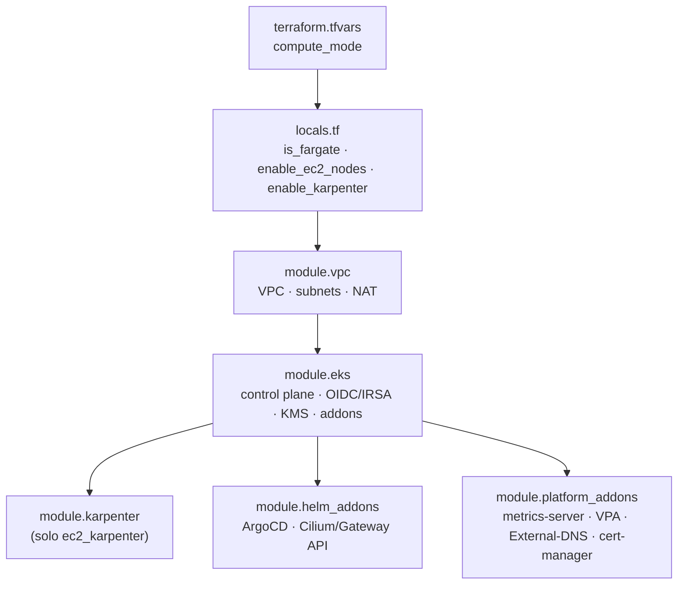
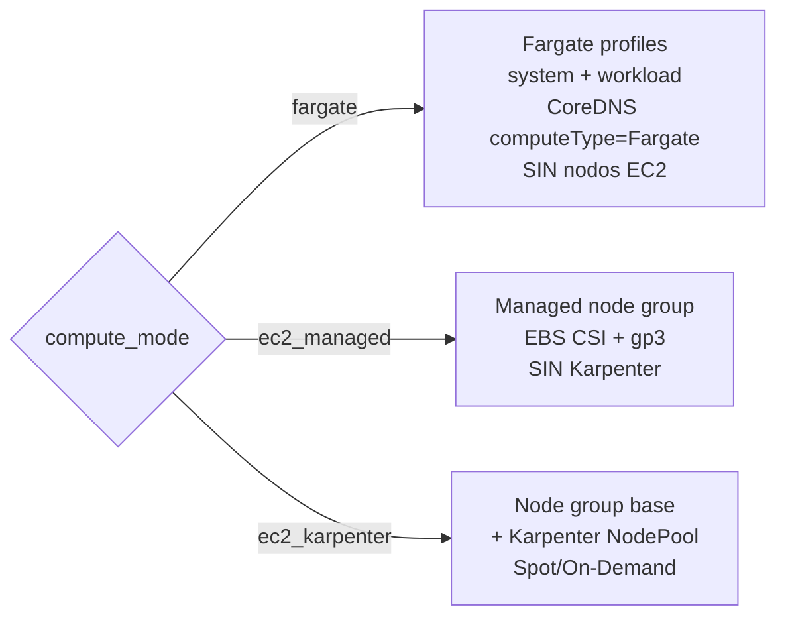

# EKS Platform — Runbook Operativo

Cluster EKS modular en Terraform. Conmuta entre **Fargate** (serverless total) y **EC2**
(managed node group ± Karpenter) cambiando **una sola variable**: `compute_mode`.

---

## 0. Arquitectura

**Topología de módulos:**



**Decisión de cómputo (dentro de `module.eks`):**



---

## 1. Modos de cómputo (`compute_mode`)

| Valor | Nodos | Autoscaling | Fargate | Uso típico |
|---|---|---|---|---|
| `fargate` | Ninguno (serverless) | HPA + VPA | kube-system + workloads | Default. Cargas variables, bajo mantenimiento de infra. |
| `ec2_managed` | Managed node group fijo | HPA + VPA (nodos fijos) | No | Cargas estables, DaemonSets, control de instancias. |
| `ec2_karpenter` | Node group base + Karpenter | Karpenter (nodos) + HPA/VPA | No | Producción, escalado dinámico Spot/On-Demand. |

La lógica se deriva en `locals.tf`:

```hcl
is_fargate       = var.compute_mode == "fargate"
enable_ec2_nodes = contains(["ec2_managed", "ec2_karpenter"], var.compute_mode)
enable_karpenter = var.compute_mode == "ec2_karpenter"
```

---

## 2. Cómo conmutar (procedimiento)

1. Editar `terraform.tfvars`:
   ```hcl
   compute_mode = "fargate"   # o "ec2_managed" | "ec2_karpenter"
   ```
2. Dry-run obligatorio:
   ```bash
   terraform plan -out=tfplan
   ```
3. Revisar el plan (ver §4 Blast Radius) y aplicar:
   ```bash
   terraform apply tfplan
   ```
4. Actualizar kubeconfig y verificar:
   ```bash
   aws eks update-kubeconfig --region us-east-1 --name <cluster>
   kubectl get pods -A -o wide      # confirmar dónde corren los pods (fargate-* vs ip-*)
   kubectl get nodes                # vacío en fargate puro; nodos en modos ec2_*
   ```

> El backend es **S3 + DynamoDB lock**. No editar el state a mano; usar `terraform state` si hace falta.

---

## 3. Variables clave

| Variable | Aplica en | Descripción |
|---|---|---|
| `compute_mode` | Todos | Selector Fargate/EC2. Única variable a tocar para conmutar. |
| `fargate_namespaces` | `fargate` | Namespaces de aplicación en Fargate. |
| `fargate_system_namespaces` | `fargate` | Namespaces de sistema (default `["kube-system"]`). CoreDNS/addons. |
| `eks_node_instance_types` / `eks_node_*_size` | `ec2_*` | Dimensionamiento del managed node group. Ignorados en Fargate. |
| `karpenter_use_spot` / `karpenter_nodepool_*_limit` | `ec2_karpenter` | Config del NodePool de Karpenter. |
| `eks_cluster_version` | Todos | Versión de Kubernetes del control plane. |

---

## 4. Blast Radius por transición

| Transición | Qué pasa | Riesgo |
|---|---|---|
| `fargate` → `ec2_*` | Crea node group EC2, IRSA EBS CSI y (si karpenter) NodePool. Elimina Fargate profiles → los pods se re-schedulan a EC2. | Downtime breve de workloads durante el re-schedule. Drenar antes si es crítico. |
| `ec2_*` → `fargate` | Destruye node group EC2, EBS CSI addon y Karpenter. Crea Fargate profiles + parcha CoreDNS a `computeType=Fargate`. | **PVCs sobre EBS dejan de adjuntarse** (Fargate no soporta EBS). Migrar a EFS antes. DaemonSets (Falco, agentes) dejan de correr. |
| `ec2_managed` ↔ `ec2_karpenter` | Añade/quita Karpenter controller + NodePool. Node group base intacto. | Bajo. Karpenter tarda ~1 min en tomar control del scaling. |

**Protección incluida:** bloques `moved{}` en `modules/eks/main.tf` mapean el recurso previo
(`aws_eks_node_group.main` → `main[0]`, etc.), evitando destroy/recreate al introducir `count`.
Verificar en el `plan` que el node group existente aparece como `moved`, **no** como `destroy`.

---

## 5. Rollback

1. `git revert <commit>` (o volver el valor de `compute_mode` en `tfvars`).
2. `terraform plan -out=rollback.plan` y revisar.
3. `terraform apply rollback.plan`.

El state en S3 no se corrompe: los `moved{}` y los `count` son idempotentes. Si un apply
falla a mitad, `terraform apply` es reentrante (retomar) o `terraform state list` para inspeccionar.

---

## 6. Notas por modo

**Fargate puro**
- CoreDNS corre en Fargate vía `configuration_values = { computeType = "Fargate" }` del addon (nativo, sin `kubectl patch`).
- Sin DaemonSets: Falco (kernel access) y cualquier agente node-level **no** funcionan. Usar alternativas sidecar/Fargate-compatibles.
- Persistencia: usar **EFS CSI** (`aws-efs-csi-driver`), no EBS. El StorageClass `gp3` queda inerte.
- Cada pod = una micro-VM; el sizing sale de `requests/limits` (ajustados por VPA).

**EC2 (`ec2_managed` / `ec2_karpenter`)**
- EBS CSI + StorageClass `gp3` operativos para PVCs.
- DaemonSets funcionan (observabilidad, seguridad node-level).
- `ec2_karpenter`: Karpenter provisiona nodos bajo demanda; el node group base sostiene el controller y system pods.

---

## 7. Validación local (sin credenciales AWS)

```bash
terraform fmt -recursive
terraform init -backend=false
terraform validate
```

Para `plan`/`apply` reales se requiere el profile AWS `itera` y acceso al backend S3.
